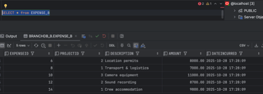
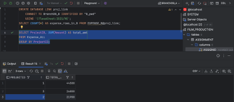

# 🎬 FILM PRODUCTION & CREW MANAGEMENT SYSTEM

### **Advanced Database Project-Based Final Exam (Oracle 19c)**

**Course:** Parallel & Distributed Database Systems  
**Student:** _Frank KWIBUKA_  
**Reg No:** _216 128 218_  
**Institution:** _University of Rwanda / AFRICAN CENTRE OF EXCELLENCE IN DATA SCIENCE (ACE-DS) _
**Academic Year:** 2025/2026

---

## 📌 Project Overview

This project demonstrates the implementation of a **distributed and parallel database system** for a Film Production
Management environment using **Oracle 19c**.  
It focuses on **data fragmentation, distributed querying, two-phase commit, parallel execution, declarative constraints,
recursive queries, inference rules, and trigger-based automation.**

The primary dataset revolves around **Projects**, **Expenses**, and **Crew Assignments**, while ensuring distributed
consistency across two database nodes:

A **Database Link** enables cross-node joins, distributed transactions, and consistency operations.

---

## 🏗 System Architecture

```mermaid
                   ┌────────────────────┐
                   │ FILM_PRODUCTION DB │
                   │  (Original Source) │
                   └──────┬─────────────┘
                          │ SELECT Privileges
            ┌─────────────┴─────────────┐
            │                           │
 ┌──────────▼─────────┐       ┌─────────▼──────────┐
 │   BranchDB_A       │       │   BranchDB_B        │
 │  Expense_A (ODD)   │       │  Expense_B (EVEN)   │
 └─────────┬──────────┘       └─────────┬───────────┘
           │ DATABASE LINK (proj_link)   │
           └───────────────┬─────────────┘
                           ▼
                 ┌───────────────────┐
                 │   Expense_ALL     │
                 │ (Unified View)    │
                 └───────────────────┘
```

## ✅ Tasks

## **A1: Fragment & Recombine Main Fact (Expense)**

- FILM_PRODUCTION is the main schema that contains original tables
- From FILM_PRODUCTION schema grand select previllages to BRANCHDB_A and BRANCHDB_B

```sql
-----------------------------------------------------------
-- In BranchDB_A: create horizontal fragments (e.g., odd IDs)
-----------------------------------------------------------
-- CONNECT BranchDB_A/A_pwd
-- Minimal subset: Expense_A
CREATE TABLE Expense_A AS
SELECT *
FROM FILM_PRODUCTION.EXPENSE
WHERE MOD(EXPENSEID, 2) = 1;
-----------------------------------------------------------
-- In BranchDB_B: create horizontal fragments (e.g., even IDs)
-----------------------------------------------------------
-- CONNECT BranchDB_B/B_pwd
-- Minimal subset: Expense_B
CREATE TABLE Expense_B AS
SELECT *
FROM FILM_PRODUCTION.EXPENSE
WHERE MOD(EXPENSEID, 2) = 0;
```


#### original expense table


#### node_A expense_table



#### node_B expense_table

-
    3. On Node_A, create view Expense_ALL as UNION ALL of Expense_A and Expense_B@proj_link.
-
    4. Validate with COUNT(*) and a checksum on a key column (e.g., SUM(MOD(primary_key,97))) :results must match
       fragments vs Expense_ALL

```sql
-- Combined view
CREATE
OR REPLACE VIEW Expense_ALL AS
SELECT *
FROM Expense_A
UNION ALL
SELECT *
FROM Expense_B@proj_link;

-- Validate with COUNT(*) and a checksum on a key column
SELECT (SELECT COUNT(*) FROM Expense_A)           AS CNT_A,
       (SELECT COUNT(*) FROM Expense_B@proj_link) AS CNT_B,
       (SELECT COUNT(*) FROM Expense_ALL)         AS CNT_ALL
FROM dual;
```


## **A2: Database Link & Cross-Node Join**

-
    1. From Node_A, create database link 'proj_link' to Node_B.

 ```sql
-- From BranchDB_A, create a link to BranchDB_B (adjust host/service)
-- CONNECT BranchDB_A/A_pwd
CREATE
DATABASE LINK proj_link
    CONNECT TO BranchDB_B IDENTIFIED BY "B_pwd1"
    USING '//localhost:1521/XE';
```


-
    2. Run remote SELECT on Project@proj_link showing up to 5 sample rows.

```sql
-- Run remote SELECT on Project@proj_link showing up to 5 sample rows.
SELECT COUNT(*) AS project_rows_in_B
FROM Project_B@DBLINK_TO_B;
```


-
    3. Run a distributed join: local Expense_A (or base Expense) joined with remote Assignment@proj_link returning3. Run
       a distributed join: local Expense_A (or base Expense) joined with remote Assignment@proj_link returning

```sql
SELECT e.ProjectID,
       e.Description AS Expense_Description,
       e.Amount      AS Expense_Amount,
       a.ASSIGNID,
       a.CrewID,
       a.DailyRate
FROM Expense_A e
         JOIN Assignment@proj_link a
              ON e.ProjectID = a.ProjectID;
```


## **A3: Parallel vs Serial Aggregation (≤10 rows data)**

-
    1. Run a SERIAL aggregation on Expense_ALL over the small dataset

```sql
SELECT ProjectID, SUM(Amount) AS total_amt
FROM Expense_ALL
GROUP BY ProjectID;
```



-
    2. Run the same aggregation with /*+ PARALLEL(Expense_A,8) PARALLEL(Expense_B,8) */ to force a parallel plan despite
       small size.

```sql
SELECT /*+ PARALLEL(Expense_A,8) PARALLEL(Expense_B,8) */
    ProjectID,
    SUM(Amount) AS total_amt
FROM Expense_ALL
GROUP BY ProjectID;
```


-
    3. Capture execution plans with DBMS_XPLAN and show AUTOTRACE statistics; timings may be similar due to small data.

```sql
EXPLAIN
PLAN FOR
SELECT /*+ FULL(bs) */ COUNT(*)
FROM Expense_ALL bs;
SELECT *
FROM TABLE(DBMS_XPLAN.DISPLAY);

EXPLAIN
PLAN FOR
SELECT /*+ PARALLEL(bs, 8) */ COUNT(*)
FROM Expense_ALL bs;
SELECT *
FROM TABLE(DBMS_XPLAN.DISPLAY);
```


-
    4. Produce a 2-row comparison table (serial vs parallel) with plan notes.

```sql
SELECT *
FROM TABLE(DBMS_XPLAN.DISPLAY_CURSOR(NULL, NULL, 'ALLSTATS LAST'));
```


## **A4: Two-Phase Commit & Recovery (2 rows)**

-
    1. Write one PL/SQL block that inserts ONE local row (related to Expense) on Node_A and ONE remote row into
       Expense@proj_link (or Project@proj_link); then COMMIT.

 ```sql
BEGIN
INSERT INTO Expense_A
VALUES (11, 1, 'Editing', 500, SYSDATE);
INSERT INTO Expense_B@proj_link
VALUES (12, 2, 'Music', 300, SYSDATE);
COMMIT;
END;
/
```


-
    2. Induce a failure in a second run (e.g., disable the link between inserts) to create an in-doubt transaction;
       ensure any extra test rows are ROLLED BACK to keep within the ≤10 committed row budget.
-
    3. Query DBA_2PC_PENDING; then issue COMMIT FORCE or ROLLBACK FORCE; re-verify consistency on both nodes.
-
    4. Repeat a clean run to show there are no pending transactions.

```sql
BEGIN
INSERT INTO Expense_A
VALUES (13, 1, 'Editing 1', 500, SYSDATE);
INSERT INTO Expense_B@proj_link
VALUES (14, 2, 'Music 1', 300, SYSDATE);
COMMIT;
END;
SELECT *
FROM DBA_2PC_PENDING
WHERE LOCAL_TRAN_ID LIKE '%';
```


## **A5: Distributed Lock Conflict & Diagnosis (no extra rows)**

-
    1. Open Session 1 on Node_A: UPDATE a single row in Project or Expense and keep the transaction open
-
    2. Open Session 2 from Node_B via Project@proj_link or Expense@proj_link to UPDATE the same logical row.

```sql
UPDATE Project_B@proj_link
SET Budget = 20500
WHERE ProjectID = 1;
UPDATE Project_A
SET Budget = 20500
WHERE ProjectID = 1;

SELECT sid, type, lmode, request, id1, id2, block
FROM v$lock
WHERE type = 'TX';
```


-
    3. Query lock views (DBA_BLOCKERS/DBA_WAITERS/V$LOCK) from Node_A to show the waiting session.
       

-
    4. Release the lock; show Session 2 completes. Do not insert more rows; reuse the existing ≤10.
       

## **B6: Declarative Rules Hardening (≤10 committed rows)**

-
    1. On tables Project and Expense, add/verify NOT NULL and domain CHECK constraints suitable

```sql
ALTER TABLE Expense
    ADD CONSTRAINT chk_amt_positive CHECK (Amount > 0);
ALTER TABLE Expense
    ADD CONSTRAINT chk_date_valid CHECK (DateIncurred >= DATE '2024-01-01');
ALTER TABLE Project
    ADD CONSTRAINT chk_budget_positive CHECK (Budget > 0);
ALTER TABLE Project
    ADD CONSTRAINT chk_date_order CHECK (StartDate <= EndDate);
```


-
    2. Prepare 2 failing and 2 passing INSERTs per table to validate rules, but wrap failing ones in a block and
       ROLLBACK

```sql
DECLARE
v_error VARCHAR2(4000);
BEGIN
BEGIN
        DBMS_OUTPUT.PUT_LINE
('Attempting invalid expense (negative amount)...');
INSERT INTO Expense(ExpenseID, ProjectID, Description, Amount, DateIncurred)
VALUES (101, 1, 'Negative Amount', -50, SYSDATE);
EXCEPTION
        WHEN OTHERS THEN
            v_error := SQLERRM;
            DBMS_OUTPUT.PUT_LINE
('❌ Expected fail: ' || v_error);
ROLLBACK;
END;
BEGIN
        DBMS_OUTPUT.PUT_LINE
('Attempting invalid expense (too old date)...');
INSERT INTO Expense (ExpenseID, ProjectID, Description, Amount, DateIncurred)
VALUES (102, 1, 'Old Date', 500, DATE '2023-12-31');
EXCEPTION
        WHEN OTHERS THEN
            v_error := SQLERRM;
            DBMS_OUTPUT.PUT_LINE
('❌ Expected fail: ' || v_error);
ROLLBACK;
END;
BEGIN
        DBMS_OUTPUT.PUT_LINE
('Attempting invalid project (negative budget)...');
INSERT INTO Project (ProjectID, Title, Budget, StartDate, EndDate)
VALUES (201, 'Invalid Budget Project', -10000, DATE '2024-01-01', DATE '2024-12-31');
EXCEPTION
        WHEN OTHERS THEN
            v_error := SQLERRM;
            DBMS_OUTPUT.PUT_LINE
('❌ Expected fail: ' || v_error);
ROLLBACK;
END;
BEGIN
        DBMS_OUTPUT.PUT_LINE
('Attempting invalid project (start after end)...');
INSERT INTO Project (ProjectID, Title, Budget, StartDate, EndDate)
VALUES (202, 'Reversed Dates', 50000, DATE '2024-12-31', DATE '2024-01-01');
EXCEPTION
        WHEN OTHERS THEN
            v_error := SQLERRM;
            DBMS_OUTPUT.PUT_LINE
('❌ Expected fail: ' || v_error);
ROLLBACK;
END;
    DBMS_OUTPUT.PUT_LINE
('✅ All invalid cases failed as expected.');
END;
```


-
    3. Show clean error handling for failing cases.
- verify inserted record , even if we have tried to insert two project only one with valid case was inserted
  

## **B7: E–C–A Trigger for Denormalized Totals (small DML set)**

-
    1. Create an audit table Project_AUDIT(bef_total NUMBER, aft_total NUMBER, changed_at TIMESTAMP, key_col VARCHAR2(
       64)).

```sql
CREATE TABLE Project_AUDIT
(
    bef_total  NUMBER,
    aft_total  NUMBER,
    changed_at TIMESTAMP,
    key_col    VARCHAR2(64)
);
```


-
    2. Implement a statement-level AFTER INSERT/UPDATE/DELETE trigger on Expense that recomputes denormalized totals in
       Project once per statement.

```sql
CREATE
OR REPLACE TRIGGER trg_expense_totals
AFTER INSERT OR
UPDATE OR
DELETE
ON Expense
DECLARE
v_before NUMBER; v_after
NUMBER;
BEGIN
SELECT NVL(SUM(Amount), 0)
INTO v_before
FROM Expense_A;
UPDATE Project p
SET Budget = (SELECT NVL(SUM(Amount), 0) FROM Expense_A e WHERE e.ProjectID = p.ProjectID)
WHERE EXISTS (SELECT 1 FROM Expense_A e WHERE e.ProjectID = p.ProjectID);
SELECT NVL(SUM(Amount), 0)
INTO v_after
FROM Expense_A;
INSERT INTO Project_AUDIT
VALUES (v_before, v_after, SYSTIMESTAMP, 'Expense_A');
END;
```


-
    3. Execute a small mixed DML script on CHILD affecting at most 4 rows in total; ensure net committed rows across the
       project remain ≤10.
-
    4. Log before/after totals to the audit table (2–3 audit rows).

```sql
SELECT *
FROM Project_AUDIT;

update EXPENSE
set AMOUNT=AMOUNT + 1
where EXPENSEID < 10;
COMMIT;
SELECT *
FROM Project_AUDIT;
```


## **B8: Recursive Hierarchy Roll-Up (6–10 rows)**

-
    1. Create table HIER(parent_id, child_id) for a natural hierarchy (domain-specific).
-
    2. Insert 6–10 rows forming a 3-level hierarchy.

```sql
CREATE TABLE HIER
(
    parent_id NUMBER,
    child_id  NUMBER
);
```


-
    3. Write a recursive WITH query to produce (child_id, root_id, depth) and join to Expense or its parent to compute
       rollups

```sql
WITH roll (child_id, root_id, depth) AS (SELECT child_id, child_id, 1
                                         FROM HIER
                                         WHERE parent_id IS NULL
                                         UNION ALL
                                         SELECT h.child_id, r.root_id, r.depth + 1
                                         FROM HIER h
                                                  JOIN roll r ON h.parent_id = r.child_id)
SELECT r.child_id, r.root_id, r.depth, e.Amount
FROM roll r
         JOIN Expense_A e ON e.ProjectID = r.child_id
    FETCH FIRST 10 ROWS ONLY;
```


## **B9: Mini-Knowledge Base with Transitive Inference (≤10 facts)**

-
    1. Create table TRIPLE(s VARCHAR2(64), p VARCHAR2(64), o VARCHAR2(64)).

```sql
CREATE TABLE TRIPLE
(
    s VARCHAR2(64),
    p VARCHAR2(64),
    o VARCHAR2(64)
);
```


-
    2. Insert 8–10 domain facts relevant to your project (e.g., simple type hierarchy or rule implications).

```sql
INSERT INTO TRIPLE
VALUES ('Camera', 'isA', 'Equipment');
INSERT INTO TRIPLE
VALUES ('Equipment', 'isA', 'Asset');
INSERT INTO TRIPLE
VALUES ('Catering', 'isA', 'Service');
INSERT INTO TRIPLE
VALUES ('Service', 'isA', 'ExpenseType');
INSERT INTO TRIPLE
VALUES ('Asset', 'isA', 'ExpenseType');
COMMIT;
select *
from TRIPLE
```


-
    3. Write a recursive inference query implementing transitive isA*; apply labels to base records and return up to 10
       labeled rows.

```sql
WITH isa(s, o) AS (SELECT s, o
                   FROM TRIPLE
                   WHERE p = 'isA'
                   UNION ALL
                   SELECT i.s, t.o
                   FROM isa i
                            JOIN TRIPLE t ON i.o = t.s AND t.p = 'isA')
SELECT DISTINCT s AS item, o AS inferred_type
FROM isa;
```


## **B10: Business Limit Alert (Function + Trigger) (row-budget safe)**

-
    1. Create BUSINESS_LIMITS(rule_key VARCHAR2(64), threshold NUMBER, active CHAR(1) CHECK(active IN('Y','N'))) and
       seed exactly one active rule.

```sql
CREATE TABLE BUSINESS_LIMITS
(
    rule_key  VARCHAR2(64) PRIMARY KEY,
    threshold NUMBER,
    active    CHAR(1) CHECK (active IN ('Y', 'N'))
);
INSERT INTO BUSINESS_LIMITS
VALUES ('MAX_EXPENSE', 500, 'Y');
COMMIT;
```


-
    2. Implement function fn_should_alert(...) that reads BUSINESS_LIMITS and inspects current data in Expense or
       Project to decide a violation

```sql
CREATE
OR REPLACE FUNCTION fn_should_alert(p_amount NUMBER)
RETURN NUMBER IS
  v_threshold NUMBER;
BEGIN
SELECT threshold
INTO v_threshold
FROM BUSINESS_LIMITS
WHERE rule_key = 'MAX_EXPENSE'
  AND active = 'Y';
RETURN CASE WHEN p_amount > v_threshold THEN 1 ELSE 0 END;
END;
```


-
    3. Create a BEFORE INSERT OR UPDATE trigger on Expense (or relevant table) that raises an application error when
       fn_should_alert returns 1.

```sql
CREATE
OR REPLACE TRIGGER trg_expense_limit
BEFORE INSERT OR
UPDATE ON Expense_A
    FOR EACH ROW
BEGIN
  IF
fn_should_alert(:NEW.Amount)=1 THEN
    RAISE_APPLICATION_ERROR(-20001,'Expense exceeds configured threshold!');
END IF;
END;
```


-
    4. Demonstrate 2 failing and 2 passing DML cases; rollback the failing ones so total committed rows remain within
       the ≤10 budget.

```sql
BEGIN
INSERT INTO Expense
VALUES (30, 1, 'Over Budget', 800, SYSDATE);
EXCEPTION WHEN OTHERS THEN
  DBMS_OUTPUT.PUT_LINE('Expected threshold fail: '||SQLERRM);
ROLLBACK;
END;
/
INSERT INTO Expense VALUES (31,1,'Valid Spend',400,SYSDATE);
COMMIT;

SELECT *
FROM Expense;
```


